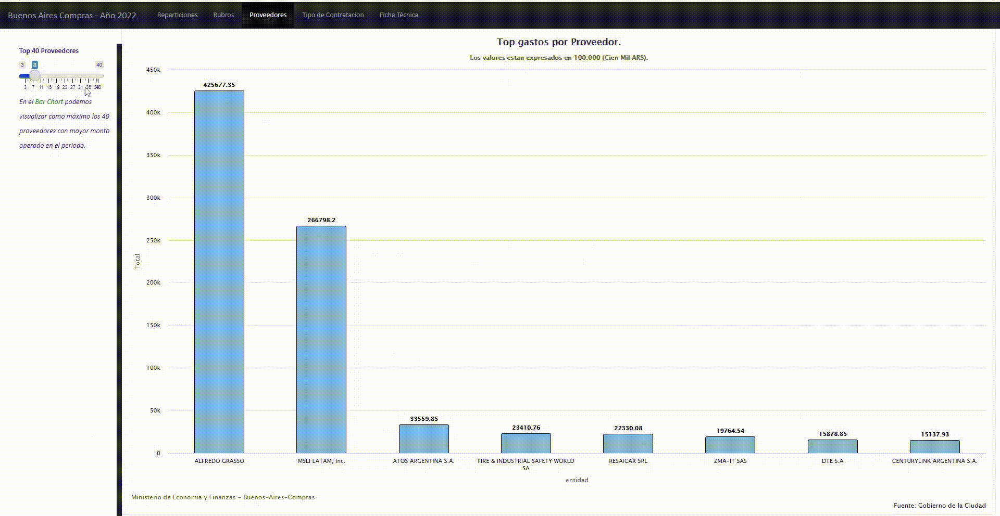

# Compras BAC

### Contenido:

- [**Introduccion**](https://github.com/MGaloto/compras_gcb#introduccion)
- [**Librerias**](https://github.com/MGaloto/compras_gcb#librerias)
- [**Metodologia**](https://github.com/MGaloto/compras_gcb#metodologia)
- [**Resultados**](https://github.com/MGaloto/compras_gcb#resultados)

## Introduccion

 <a href="#top">Volver al Inicio</a>

Buenos Aires Compras (BAC) es el sistema electrónico de compras y contrataciones del Gobierno de la Ciudad Autónoma de Buenos Aires. Es una herramienta de apoyo en la gestión de Compras y Contrataciones que llevan adelante las entidades gubernamentales, permitiendo la participación de los compradores, proveedores y la comunidad. De esta manera, la compra pública atraviesa los pasos necesarios para ofertar y adquirir los productos de forma online, ágil, transparente y segura.

Todas las jurisdicciones dependientes del Poder Ejecutivo de la Ciudad Autónoma de Buenos Aires publican en BAC sus avisos y gestionan procesos electrónicos de adquisición y contratación de bienes y servicios, en los que seleccionan a los proveedores en base a las ofertas cargadas a tal fin en el sistema.

El Gobierno de la Ciudad de Buenos Aires hace disponible el acceso a información sobre las contrataciones públicas que le permite saber cómo se gestionan las mismas.
La política de datos abiertos del Gobierno de la Ciudad de Buenos Aires nos permite poder realizar análisis de datos sobre los distintos tipos de gastos por repartición.

Este trabajo consiste en la automatizacion de la extraccion de datos de Buenos Aires Compras para plasmar la informacion en un dashboard que nos muestre los siguientes items:

- Montos totales operados en el periodo, desglosados por rubro y repartición. ✅
- Montos comprometidos por empresas. ✅
- Montos por tipo de contratación. ✅

## Librerias

 <a href="#top">Volver al Inicio</a>

Se utilizaron las siguientes librerias de R y Python para el ETL + el dashboard final:

- pandas (Python). ✅ 
- airflow (Python). ✅ 
- highcharter (R). ✅ 
- flexdashboard (R). ✅ 
- shiny (R). ✅ 

## Metodologia

 <a href="#top">Volver al Inicio</a>

Se hace lectura de un archivo .csv desde la siguiente pagina: [GCBA](https://datosgcba.github.io/bac-open-contracting/politica-publicacion/) utilizando pandas y [Airflow](https://airflow.apache.org/) para orquestar el flujo de trabajo y automatizar la tarea.

Hay que tener en cuenta los siguientes items:

- Los montos en dolares fueron convertidos a pesos Argentinos utilizando el tipo de cambio del contracts/dateSigned (La fecha en que se firmó el contrato). Esto nos permite tener todos los valores expresados en pesos Argentinos.

- El tipo de cambio utilizado es el dolar paralelo promedio entre comprador y vendedor informado por ambito.com.

- Se hizo limpieza del DataFrame inicial y solo se seleccionaron las siguientes columnas:

*tender/procuringEntity/name* (Nombre de la Organización)
*contracts/items/quantity* (El número de unidades requerido)
*contracts/items/unit/value/amount* (Monto como una cifra)
*tender/items/unit/value/currency* (Moneda)
*parties/roles* (Roles de las partes)
*tender/additionalProcurementCategories* (Categorías adicionales de contratación)
*contracts/dateSigned* (Fecha de firma)
*parties/name* (Nombre común)
*tender/procurementMethodDetails* (Detalles del método de contratación)

## Resultados

 <a href="#top">Volver al Inicio</a>

Para observar los montos operados en el periodo por Rubro y Reparticion podemos acceder a las siguientes hojas del dashboard:

  

En cada una de ellas podemos visualizar:

- Montos totales operados en el periodo desglosados por rubro y repartición ✅

Para observar los montos operados por empresa:

  

Por ultimo, para observar los montos operados por tipo de contratacion tenemos que acceder a la ante ultima hoja del dashboard.

